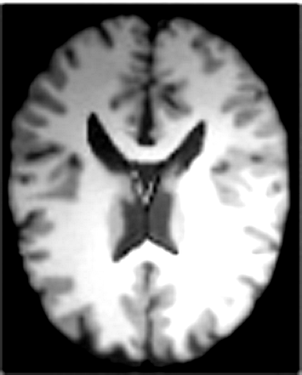

# 窗宽/窗位实验

源图像：`origin.png`

原始灰度范围：[1.00, 242.00]

## 术语说明

- **窗宽（WW）**：映射到可显示灰度的强度跨度。窗宽越窄，局部对比度越高，但更容易将范围外的结构剪切为纯黑/纯白。

- **窗位（WL）**：可见强度窗口的中心。提高窗位会将窗口向高灰度（较亮组织）移动（图像整体更暗）；降低窗位会将窗口向低灰度（较暗组织）移动（图像整体更亮）。

## 固定窗位，改变窗宽

固定窗位：123.00

- WW 72.3: 

- WW 144.6: 

- WW 241.0: 

## 固定窗宽，改变窗位

固定窗宽：120.50

- WL 45.0: 

- WL 123.0: 

- WL 172.0: 

## 综合对比图

## 观察与分析

- 窗宽较窄：在所选强度带内的局部对比度更高，但该范围之外的结构更容易被剪切为纯黑/纯白。

- 窗宽较宽：保留更多强度信息，减少剪切，但跨组织的对比度会降低。

- 提高窗位（在固定窗宽下）：窗口向较亮的强度移动，较暗组织细节变少，较亮组织细节增强。

- 降低窗位（在固定窗宽下）：窗口向较暗的强度移动，较亮组织更易饱和，较暗组织细节增强。

- 噪声与伪影：在低信噪比区域，缩小窗宽会同步放大噪声对比，易产生颗粒感；此时可适度增加窗宽或先行降噪。

- 动态范围与裁剪：过窄窗宽易造成高/低灰度端饱和（信息丢失）。可参考图像统计（如四分位间距 IQR）选择初始窗宽，并观察直方图避免严重截断。

- 目标组织优先：使关注组织的灰度分布落在窗口中部附近（调整窗位）通常能获得更佳可读性；若关注低灰度结构则降低窗位，关注高灰度结构则提高窗位。

- 交互调节策略：先用较宽窗宽观察整体解剖与病灶分布，再逐步减小窗宽并微调窗位以突出关键细节，最后对比不同设置确认最优显示。

- 适用场景：当组织间灰度跨度大且背景复杂时，先宽后窄更稳妥；当背景大面积无关、病灶与邻近组织灰度接近时，窄窗更能凸显差异。

- 局限性：线性窗（WW/WL）无法校正局部照度不均、金属伪影等问题；必要时可结合局部对比增强或自适应方法（如 CLAHE）辅助，但需防过增强。

- 显示量化：在 8-bit 显示链路下，过于狭窄的窗宽可能引入条带感（banding）；适当扩大窗宽或启用抖动/高位深显示可缓解。

- 可复现性：记录具体 WW/WL 数值与对照图，便于横向比较与多次随访复现相同观感。
