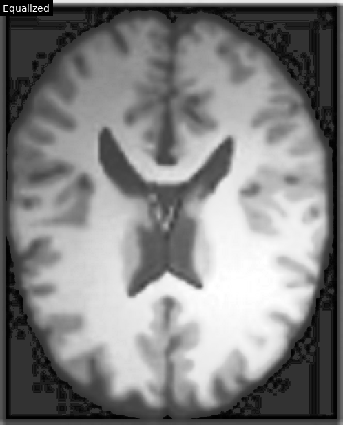

# 直方图均衡化实验

源图像：`origin.png`

## 算法原理

- 目标：通过对灰度级的累计分布函数（CDF）进行线性拉伸，使输出图像的灰度分布更均匀，从而增强对比度。

- 步骤：

  1) 统计直方图得到各灰度级计数 `h(k)`；

  2) 计算累计直方图 $cdf(k)=∑_{i=0}^k h(i)$；

  3) 构建映射 $s(k)=round((cdf(k)-cdf_{min})/(N-cdf_{min})*255)$（其中 `N` 为像素总数）；

  4) 用查找表对原图每个像素进行映射，得到均衡化结果。

## 实验结果

- 原图像：

  

- 均衡化后图像：

  

- 原图灰度直方图：

  

- 均衡化后灰度直方图：

  

- 原图累积直方图（CDF）：

  

- 均衡化后累积直方图（CDF）：

  

## 观察与分析

- 均衡化后，灰度直方图更为分散，暗部与亮部的可见细节得到增强。

- CDF 从更陡的阶梯形状变得更接近线性上升，说明灰度利用更充分。

- 低对比区域：局部暗背景与细微结构更易分辨，但可能伴随噪声放大与纹理粗糙化。

- 高对比边缘：边缘更清晰，但在量化较粗或压缩失真存在时可能出现轻微过冲/光晕。

- 亮度感知：全局均衡化可能改变整体亮度主观感受，可与线性拉伸或窗宽/窗位结合以控制亮度与对比度平衡。

- 定量观察：直方图熵（Shannon entropy）通常上升，表明灰度利用率提升；但熵增并不必然意味着关键结构的可判读性提高，需要结合任务评价。

- 局限性：全局映射对整幅图一视同仁，易在背景或低信噪区域过度增强噪声。医学影像中常用自适应直方图均衡（CLAHE）设定 clip limit 以抑制过增强。

- 适用场景：照度不均或整体对比度偏低的图像改善明显；不适用于原始对比度已较好或噪声主导的图像。

- 实践建议：优先在感兴趣区域（ROI）内尝试均衡化，或先进行去噪/直方图裁剪；若需全局增强，建议尝试 CLAHE 并调小 tile size 与 clip limit。
